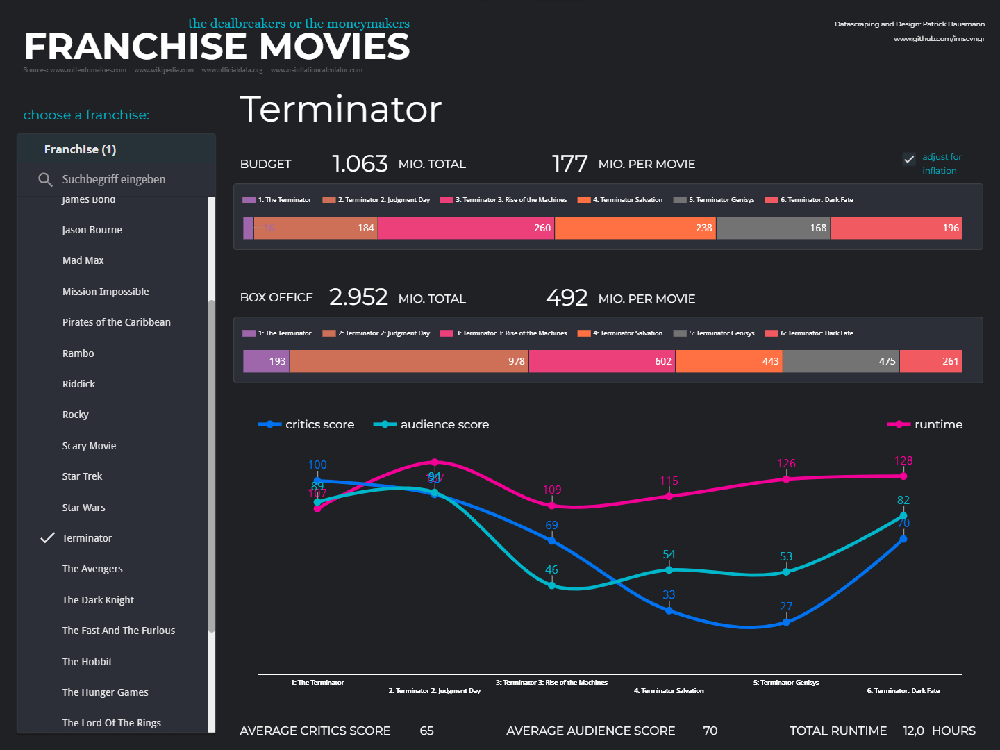
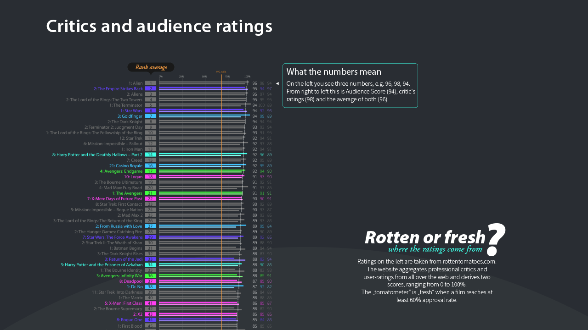
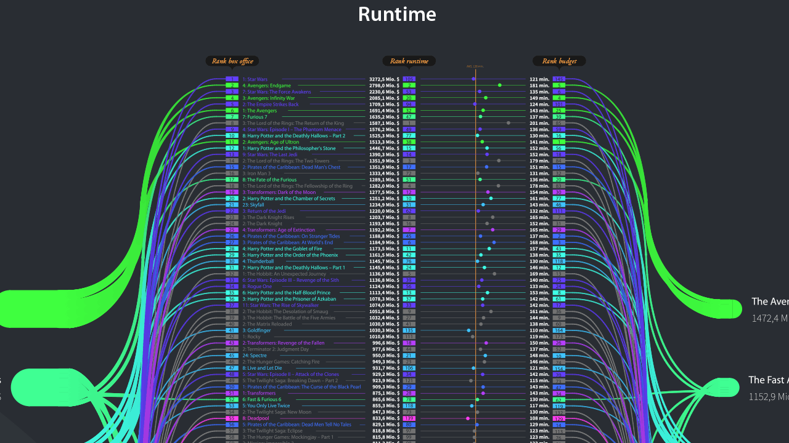
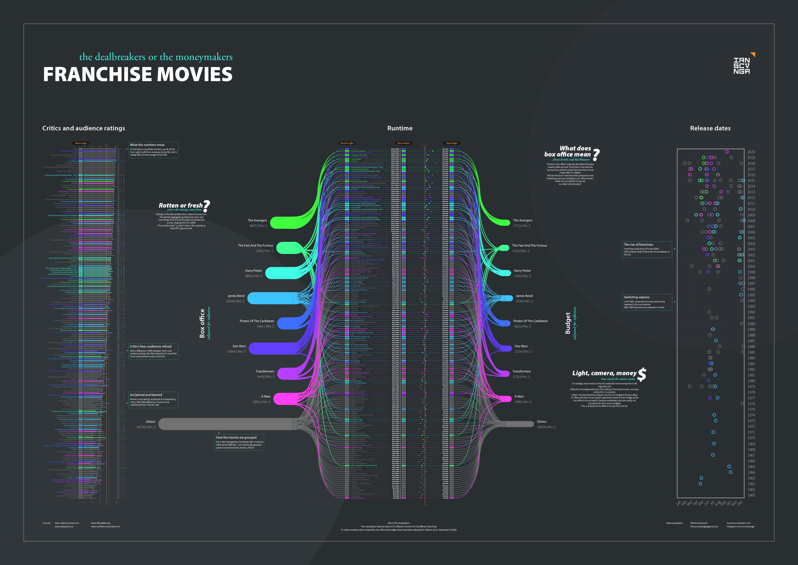

# Franchise Movie Data

## Synopsis
Data engineering and analysis project about franchise movies using Python, Processing and Google Looker Studio.
The project features 174 movies from 28 different franchises.
Monetary data was adjusted for inflation as for December of 2020.

## Results

### Dashboard
For interactive exploration I created an online-dashboard using Google Looker Studio.
It allows you to filter for a specific franchise and look at the related data.
There's also an option to switch between historic- and inflation-adjusted values.

Below you can see a screenshot of the online-dashboard made with Google Looker Studio.
Please follow this <a href="https://lookerstudio.google.com/reporting/96721ef5-a848-41e4-bc16-c7a783efda0f">[Link]</a> to find the interactive dashboard on Google Looker Studio!
 
 

 
 

### Visualization
Before creating the dashboard I had already created a large format visualization.
This was done using Processing and Adobe Illustrator.
 
Below are some images from the illustration - please refer to the <a href="https://github.com/irnscvngr/franchise_moviedata/blob/main/DataViz_FranchiseMovies.pdf">[PDF]</a> to see it as vectorgraphic in full resolution.
 
 
 
 

 
 

## Process
### Data Gathering
Data was gathered using Python's requests library. Budgets, runtime etc. were scraped from Wikipedia in 2020.
Information about critics and audience ratings was added manually due to lack of better knowledge at the time.
The gathered data was exported as a CSV-file for further processing.
 
 

### Visualization
Static data visualization was done using Processing.
An intermediate-visualization was exported as PDF.
It was then finalized in Adobe Illustrator.

## Outcome and recap
The project successfully gathers data for the required movies and stores them as CSV.
Further updates could include and automated scraping of critcs- and audience-scores.
A potential expansion of the project could also be automated updating of the database in case a new movie for a franchise is released.

