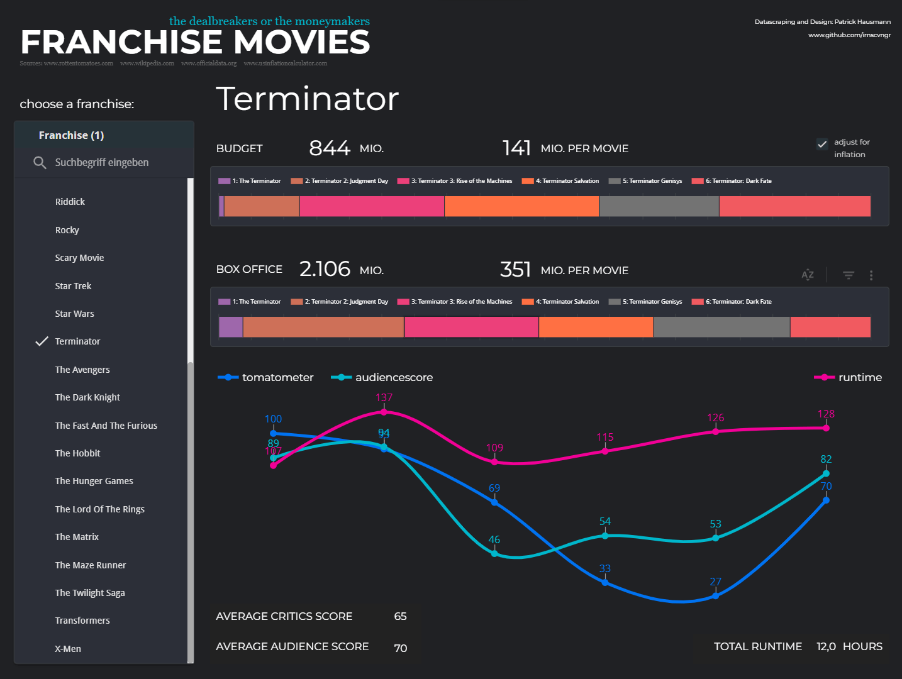

# Franchise Movie Data
Data engineering and analysis project about franchise movies using Python, Processing and Google Looker Studio.

# Data Gathering

## Results

### Dashboard
For interactive exploration I created an online-dashboard using Google Looker Studio.
It allows you to filter for a specific franchise and look at the related data.
There's also an option to switch between historic- and inflation-adjusted values.

Below you can see a screenshot of the online-dashboard made with Google Looker Studio.
Please follow this <a href="https://lookerstudio.google.com/reporting/96721ef5-a848-41e4-bc16-c7a783efda0f">[Link]</a> to find the interactive dashboard on Google Looker Studio!
 
 

### Visualization
Before creating the dashboard I had already created a large format visualization.
This was done using Processing and Adobe Illustrator.
 
Below are some images from the illustration - please refer to the <a href="https://github.com/irnscvngr/franchise_moviedata/blob/main/DataViz_FranchiseMovies.pdf">[PDF]</a> to see it as vectorgraphic in full resolution.
 
 
 
 

